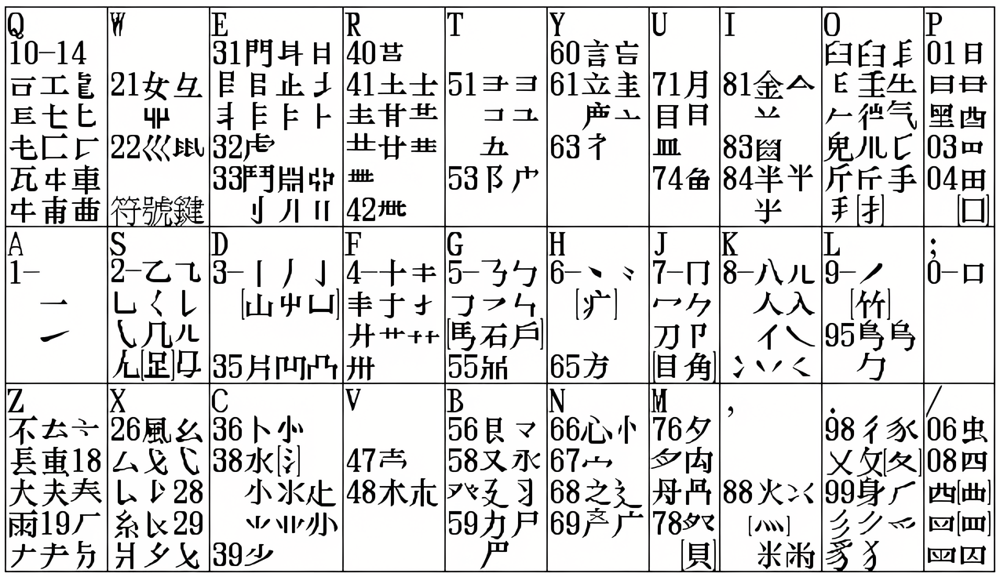

# 行列30 Classic+

固定原生碼表順位，保留連詞成句學習。

行列30 Classic+ 是一個照顧老行列用家肌肉記憶的 Rime 行列30 改造版：固定原生單字與詞組順位，同時保留連打組詞、組句與用戶學習。


本方案基於 [Rime](https://rime.im) 與 [行列30](http://www.array.com.tw/) 輸入方案，配方來源為 ℞ **array**。


## 主要特色

- 原生單字碼表不調頻，常用字不會因個人選字習慣改變候選順位。
- 原生詞組碼表不調頻，保留行列老用家的原生詞組位置記憶。
- 連續打原生單字或原生詞組時，仍可連詞成句、自動學習、自動調頻。
- 每頁顯示 5 個候選字，界面較清爽，同時保留接近原生行列的選字效率。
- 方案選單中的「漢字 - 汉字」、「半角 - 全角」、「常用 - 增廣」切換會持久化，切換輸入法或重啟後仍保持上次狀態。
- 支援 `?` 萬用字元、符號組、Emoji 建議、Unicode Emoji、拼音反查行列碼等原有功能。

## 安裝

### 平台支持

- macOS / 鼠鬚管 Squirrel：主要測試環境，已提供一鍵安裝腳本。
- Windows / 小狼毫 Weasel：核心 Rime 配置理論上可用；目前需自行安裝小狼毫，將本專案文件複製到 Rime 用戶資料夾後重新部署，尚未提供一鍵安裝腳本。
- Linux / ibus-rime / fcitx-rime / fcitx5-rime：核心配置可能可用，尚未測試。

目前下方一鍵安裝命令僅適用於 macOS / Squirrel。

### macOS 一鍵安裝

在尚未安裝 Rime 的新 Mac 上，可使用以下命令安裝鼠鬚管、拉取本倉庫配置並重新部署：

```bash
/bin/bash -c "$(curl -fsSL https://raw.githubusercontent.com/Elias-Lee-SC/rime-array30-classic-plus/main/install.sh)"
```

安裝腳本會執行以下動作：

- 檢查並安裝 Homebrew。
- 透過 Homebrew 安裝最新版可取得的鼠鬚管 Squirrel。
- 將本倉庫 clone 到 `~/Library/Rime`。
- 若本機已存在非 Git 管理的 `~/Library/Rime`，會先移到 `~/Library/Rime.backup.YYYYMMDD-HHMMSS`。
- 執行 Rime 部署並重新載入鼠鬚管。

安裝完成後，如 macOS 輸入法選單中尚未顯示鼠鬚管，請到「系統設定 > 鍵盤 > 輸入方式」手動加入 Squirrel。

### 用戶詞典與同步

本倉庫只保存輸入方案、碼表、個人配置與 Lua 擴展，不保存個人學習資料。`*.userdb/`、`installation.yaml`、`user.yaml`、`build/` 等運行時文件已排除在版本控制之外。

多年使用累積的詞頻、連打組詞與組句學習結果，請使用 Rime 官方「同步用戶資料」功能備份與合併。

## 設計思路

行列30 Classic+ 將候選來源拆成三條管線：

```text
固定單字    -> character       -> 不調頻
固定詞組    -> fixed_phrases   -> 不調頻，但保留編碼補全
連打學習    -> array30_dynamic -> 可學習，按全碼串接記住你的用詞
```

這樣可以同時滿足兩種看似矛盾的需求：原生單字和原生詞組保持固定順位，連打組詞和組句又能隨個人使用習慣學習。

## 固定原生碼表順位

### 原生單字不調頻

原生單字由固定單字管線輸出，不使用用戶詞典，不參與動態調頻。

例如 `nor`：

```text
產    nor
性    nor
```

此組重碼字，原生碼表（array30_char.dict.yaml）上「產」排在「性」之前。此版中，即使你連續多次選「性」，它也不會跑到「產」前面。這可以保留老行列用家對單字候選位置的記憶。

### 原生詞組不調頻

原生詞組由固定詞組管線輸出，也不使用用戶詞典，不參與動態調頻。

例如原生詞組：

```text
你們    kckej
```

輸入 `kcke` 時，仍可看到「你們 7-」一類逐鍵補全提示；

又如，原生詞組碼表（array30_phrases.dict.yaml）中，「燃點」在「糕點」前。

```text
燃點    ,,p;j
糕點		,,p;j
```

當輸入編碼「,,p;j」後，不管多少次選「糕點」，排列順序依舊是：1. 燃點；2. 糕點

原生詞組碼表的候選順位都不會被個人詞頻改寫。

## 連詞成句與用戶學習

行列30 Classic+ 保留 Rime 的連打學習能力。你可以連續輸入原生單字或原生詞組的字碼，讓 Rime 自動組詞、組句，並記住你的選擇。

例如：

```text
習    bblp
慣    nszm
```

連續輸入：

```text
bblpnszm
```

因為單字碼表裡「實」排在「慣」之前，所以頭幾次需要手動選成「習慣」。多選幾次後，Rime 會把「習慣」記為這條全碼連打路徑的常用詞；之後再輸入 `bblpnszm`，就會優先出「習慣」。

這類學習結果寫入 Rime 用戶詞典，例如 `array30.userdb`。它會影響連打組詞與組句，但不會反過來改動原生單字碼表和原生詞組碼表的固定順位。

### 刪除錯誤學習

連打組詞或組句時，如果中途選字遇到重碼字/詞而選錯，Rime 可能會把錯詞錯句記入用戶詞典。

重新輸入時，若看到錯詞或錯句出現在候選列，將光標移到該候選上，按下以下任一組按鍵即可刪除該用戶詞條：

- `Shift + Delete`
- `Control + Delete`
- Apple 鍵盤常見用法：`Shift + Fn+ Delete`
- 本方案也可用：`Control + k`

刪除後，錯誤學習不會繼續佔據候選位置；重新輸入正確詞句並提交，Rime 會再學習新的結果。

## 方案選單與持久切換

本方案保留 Rime 方案選單，並讓以下三組切換持久化：

- 「漢字 - 汉字」：繁體／簡體互切。
- 「半角 - 全角」：半角／全角互切。
- 「常用 - 增廣」：常用字集／增廣字集互切。

這三組切換可以在方案選單中切換，也可以使用快捷鍵：

| 功能 | 快捷鍵 |
| --- | --- |
| 漢字 - 汉字 | `Control + Shift + 0` |
| 半角 - 全角 | `Control + Shift + 9` |
| 常用 - 增廣 | `Control + Shift + 8` |

切換後，Rime 會保持上次狀態。即使切換到別的輸入法、再切回 Rime，或重啟電腦後，也會恢復上次選定的狀態，直到你再次主動切換。

## 字根表

忘記字根時，可直接查看本專案中的字根表：



若 Markdown 內嵌圖片無法顯示，也可以點開本地專案下的圖片文件：[行列字根表.png](行列字根表.png)。

## 其他輸入功能

### 詞句連書

支援連續輸入多個字之字碼。每字詞之間可以 `\` 分隔，以增加預測準確性。

### 詞彙輸入

預設使用本方案自帶之行列詞庫，符合行列官方詞彙取碼規則。為方便輸入，詞彙改以 `j` 作尾碼，代替原版行列的 `'` 尾碼。

### 符號組

沿用行列官方符號組輸入方式。輸入 `w` + 數字鍵（1 - 0）即可選取各符號分組。

### Emoji 建議

從方案選單 `🈚️->🈶️` 選擇啓用 Emoji 建議功能。啓用後，當輸入字詞時，相關意思的 emoji 將會出現在候選列上。

例如輸入 `9-9-1v` 時，候選字「笑」下方會出現 `😄` 及其他相關笑臉 emoji。

此功能基於 [Rime Emoji / 繪文字輸入方案](https://github.com/rime/rime-emoji/)。由於此功能會影響候選字順序，請斟酌使用。

### Unicode Emoji 輸入方案

此為在原行列30基礎上新增的 emoji 輸入方案。用家可透過美式鍵盤大階 `A-L` 行選取 emoji。第一層分類如下：

- `A`: 表情符號 Smileys & Emotion
- `S`: 人物及身體 People & Body
- `D`: 動物及自然界 Animals & Nature
- `F`: 食物及飲料 Food & Drink
- `G`: 旅行及地點 Travel & Places
- `H`: 活動 Activities
- `J`: 物件 Objects
- `K`: 圖標符號 Symbols
- `L`: 旗幟 Flags

所有 emoji 由二至三個鍵碼組成。更詳細的取碼原則請參考[原行列30 Unicode Emoji 說明](https://github.com/archerindigo/rime-array/wiki/RIME%E8%A1%8C%E5%88%9730-Emoji-Unicode%E8%BC%B8%E5%85%A5%E6%96%B9%E6%A1%88%E8%AA%AA%E6%98%8E)。

### `?` 萬用字元

輸入 `?` 作為單個萬用字元，支援查找二至四碼字。讓候選列列出符合條件的字。這個功能適合忘記某一碼、但仍記得部分字根位置時使用。

例如「題」字的第3碼忘記為何，可用 `?` 代替第3碼。即，輸入：

```text
pa?m
```

可查得：1. 題；2. 暊；3. 题

### 從其他輸入法反查行列30

以 `` ` `` 鍵開始輸入[拼音](https://github.com/rime/rime-luna-pinyin)，可反查行列碼。

### 簡碼及特別碼選字處理

本方案會將特別碼顯示於選字欄的首候選字。同官方輸入規則一樣，在輸入特別碼後按空白即可選出該字。

一、二級簡碼暫未編排數字鍵位；同碼的簡碼字會依碼表原序列出。

## 授權條款

見 [LICENSE](LICENSE)。
